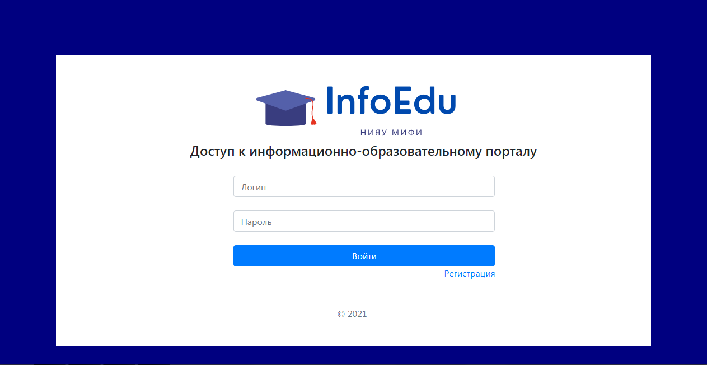
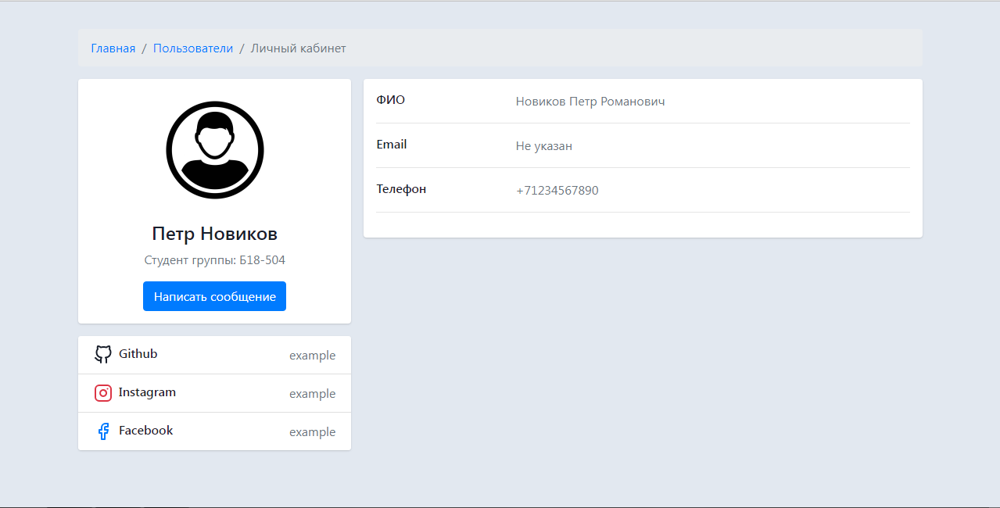
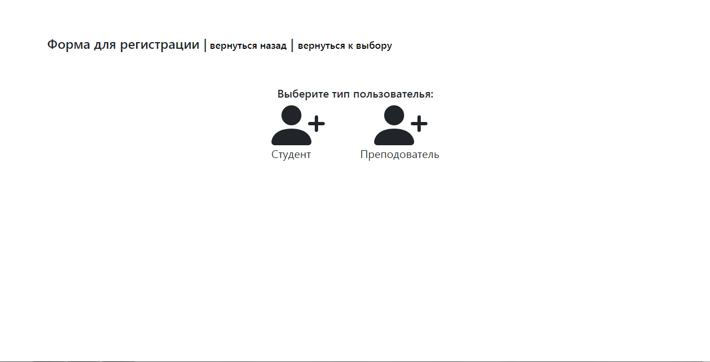
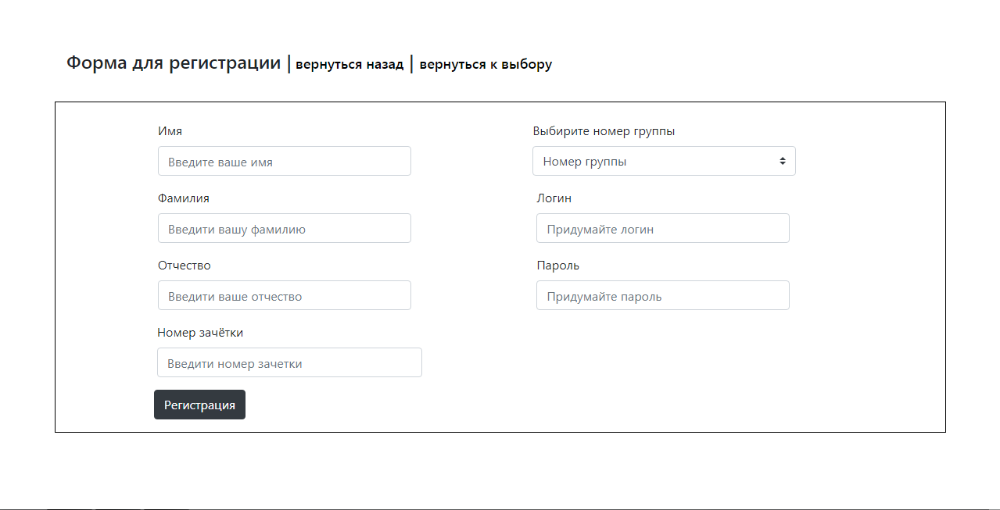
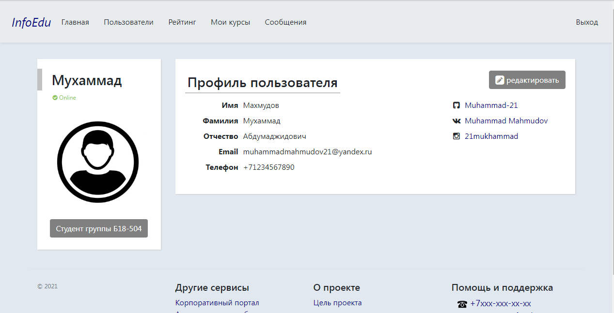
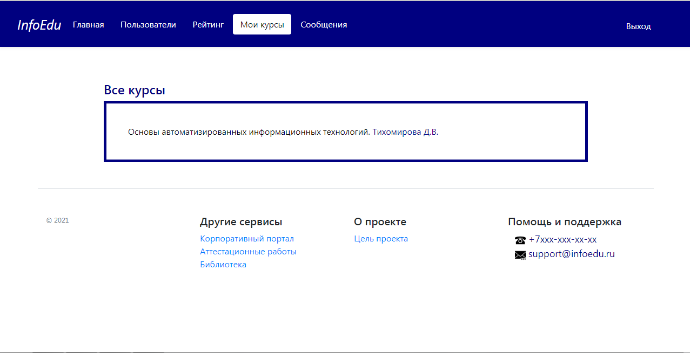
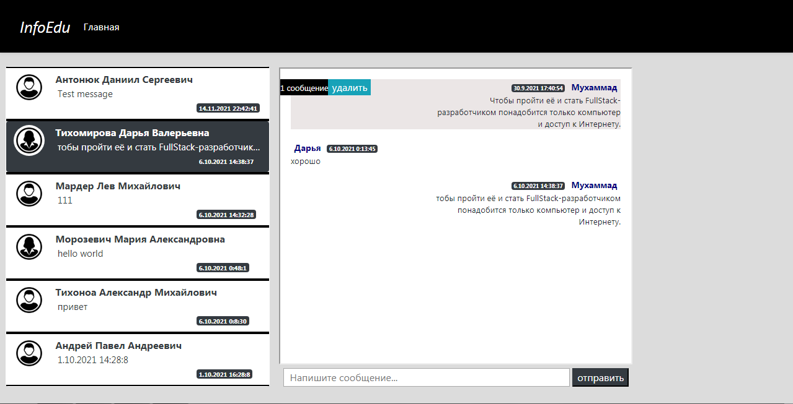
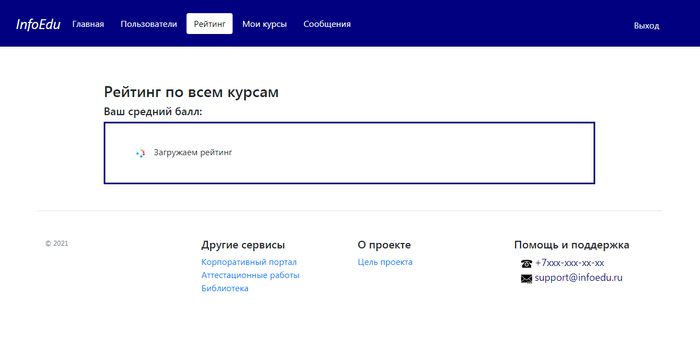
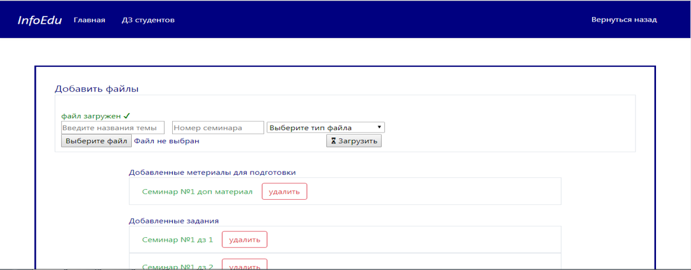

## Platform Description
***InfoEdu*** - is a system that helps students to master courses deeper and facilitates the work of teachers.  
With the help of this platform, teachers can now receive completed assignments from students and stay in touch with them without leaving the platform.Also, now students can get access to recordings of lectures or additional literature that will help them master the course deeper without leaving the platform.

_The platform is being implemented as part of Educational and Research Work._  
***The platform is under development...***
## Some screenshots of the platform
  
<strong style="text-align: center;">Home Page</strong>  

  
<strong style="text-align: center;">Viewing the user's personal account</strong> 

  
<strong style="text-align: center;">Registration form</strong>  

    

  
<strong style="text-align: center;">Personal account</strong>   

  
<strong style="text-align: center;">List of courses</strong>   

  
<strong style="text-align: center;">Messages page</strong>   

  
<strong style="text-align: center;">Students raiting</strong>  

  
<strong style="text-align: center;">Uploading files to the server</strong>  

