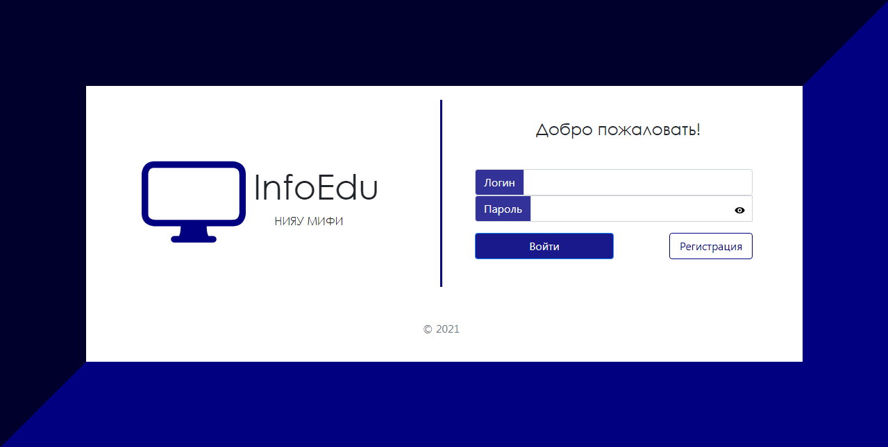

## Platform Description
***InfoEdu*** - is a system that helps students to master courses deeper and facilitates the work of teachers.  
With the help of this platform, teachers can now receive completed assignments from students and stay in touch with them without leaving the platform.Also, now students can get access to recordings of lectures or additional literature that will help them master the course deeper without leaving the platform.

_The platform is being implemented as part of Educational and Research Work._  
***The platform is under development...***
## Some screenshots of the platform
  
***Home Page***  

  
***Personal account***  

  
***List of courses***  

  
***Messages page***  

  
***Students raiting***  

  
***Uploading files to the server***  

